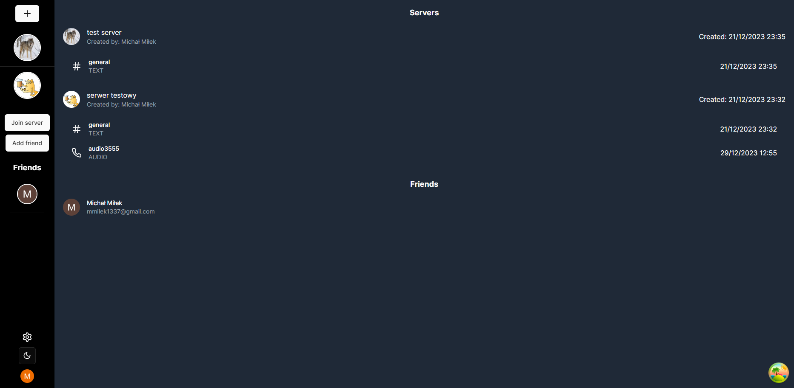
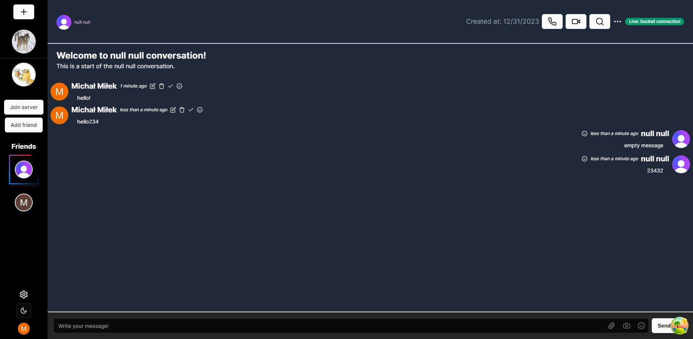
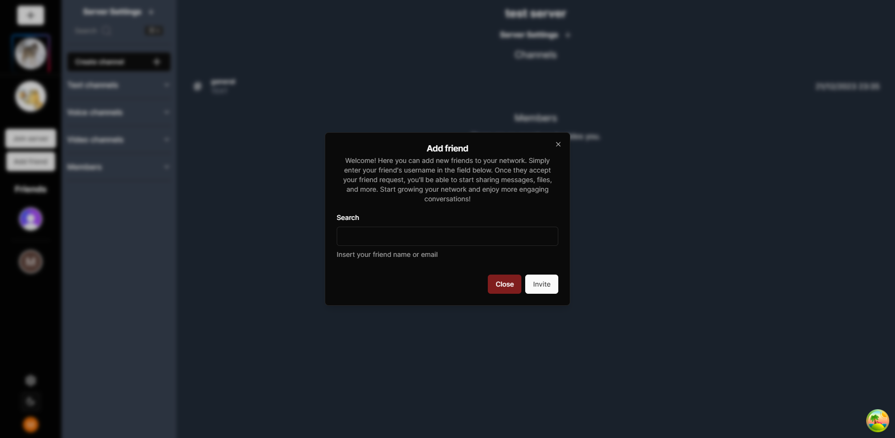
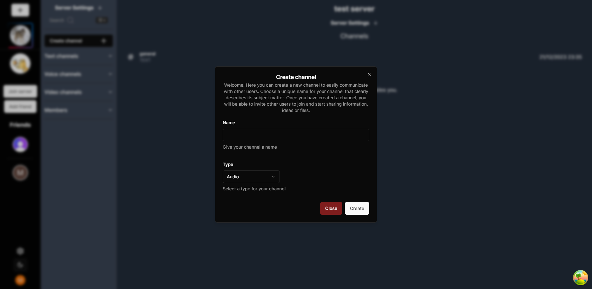
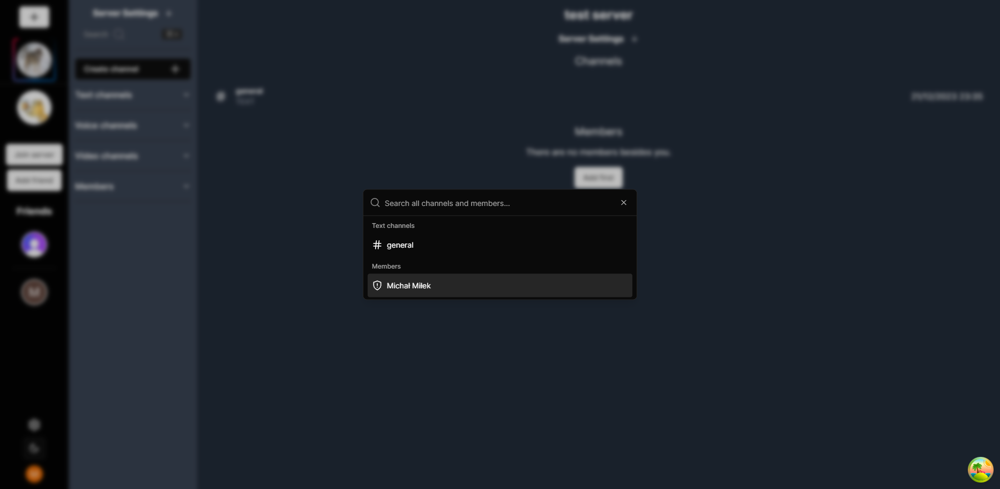
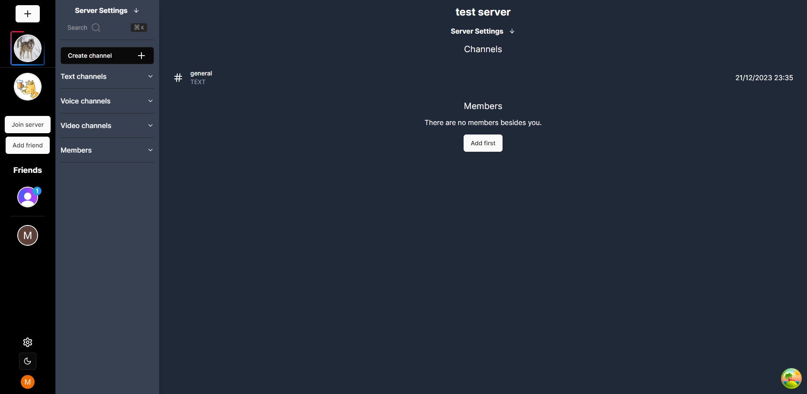

# Mini dsc Clone: Real-time Chat and Video Communication

Mini dsc Clone is a feature-rich real-time chat and voice communication application inspired by the popular platform, Discord. It is built using cutting-edge technologies to provide users with a seamless and interactive communication experience.

## Key Features

- Real-time text messaging with channels and direct messages
- Voice and video calling with low-latency audio
- User authentication and account management
- User-friendly interface with customizable themes
- Emoji support for adding personality to conversations
- Role-based access control for server management
- Rich media sharing, including images, videos (coming soon), and links
- Notification system for staying up-to-date with messages
- Scalable architecture for handling a growing user base

## Technologies Used

- Fullstack: Next.js, TypeScript
- Frontend: React.js, Zustand, Socket.io
- Backend: Node.js, Socket.io, Prisma
- Database: MySQL
- Authentication: Clerk
- Styling: Tailwind CSS, shadCN
- Deployment: [Vercel(NO SOCKETS)](https://mini-dsc-clone-git-chat-refetch-michalmilek.vercel.app)

## Channels

The application supports three types of channels: audio, video, and text. Users can communicate with each other through these channels, providing a rich and interactive communication experience.

## Real-time Communication

When new messages arrive, the user retrieves them from the database using sockets. Same with friend/server invitations. However, due to Vercel's lack of support for custom servers, the socket functionality is currently not working in vercel deployment version, resulting in some parts of the application not functioning properly. 

## Reactions And Unread messages

Every message can be replied to and messages between friends have a read and unread status. Each time a message is received, a notification button from the once popular gadu-gadu messenger plays.

## Virtualization

The message list is virtualised using react-virtualised, for better application performance.

## Deployment

The deployment of the application is still in progress and not yet finished. If you would like to test the live version, please send a private message and I will provide you with the complete configuration for the .env file.

